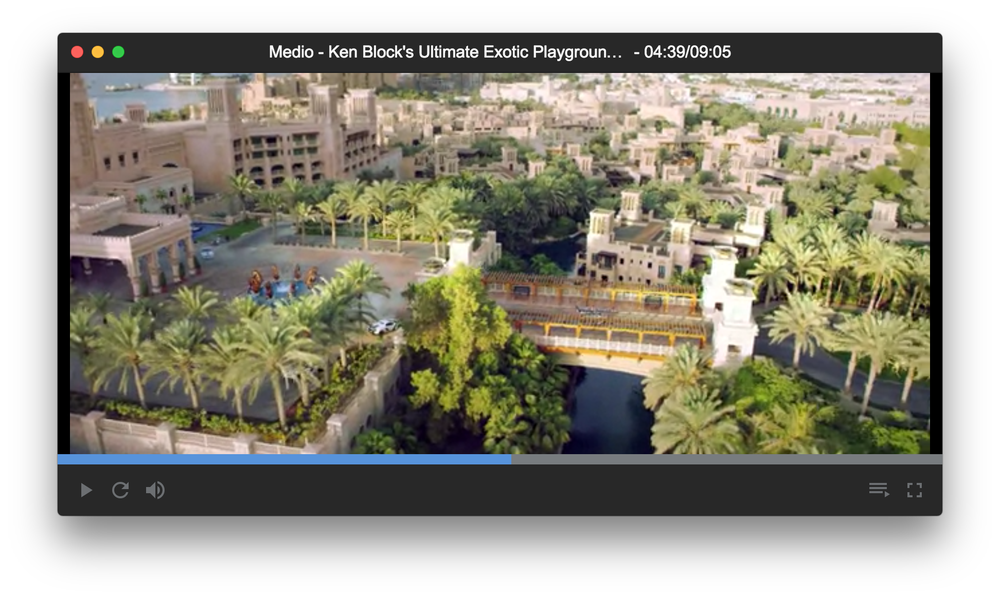
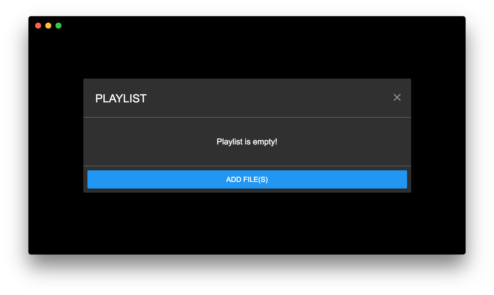
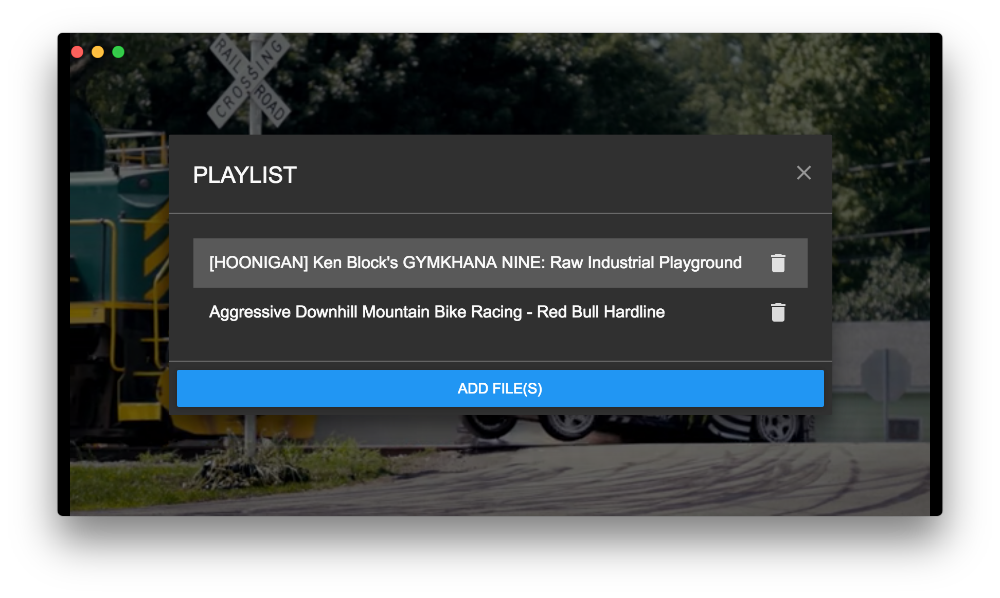

# Medio

A media player written in [NodeJS](https://nodejs.org/en/) based off of [electron](http://electron.atom.io/) and [react](https://facebook.github.io/react/).

***

**NOTE:** This project was for me (@clabby) to learn electron and react. Don't expect this app to be production-ready.

***

## Contributing
If you'd like to contribute, just clone the repository and hack away! I don't really mind the format of your pull request as long as it is clean and explains the feature that you've added clearly.

## Development

1. Clone the repo: `git clone https://github.com/clabby/medio`
2. Run `npm install`
3. Start the dev server: `npm run dev`

## Screenshots

## License

The MIT License (MIT)
Copyright (c) 2016 Ben Clabby

Permission is hereby granted, free of charge, to any person obtaining a copy of this software and associated documentation files (the "Software"), to deal in the Software without restriction, including without limitation the rights to use, copy, modify, merge, publish, distribute, sublicense, and/or sell copies of the Software, and to permit persons to whom the Software is furnished to do so, subject to the following conditions:

The above copyright notice and this permission notice shall be included in all copies or substantial portions of the Software.

THE SOFTWARE IS PROVIDED "AS IS", WITHOUT WARRANTY OF ANY KIND, EXPRESS OR IMPLIED, INCLUDING BUT NOT LIMITED TO THE WARRANTIES OF MERCHANTABILITY, FITNESS FOR A PARTICULAR PURPOSE AND NONINFRINGEMENT. IN NO EVENT SHALL THE AUTHORS OR COPYRIGHT HOLDERS BE LIABLE FOR ANY CLAIM, DAMAGES OR OTHER LIABILITY, WHETHER IN AN ACTION OF CONTRACT, TORT OR OTHERWISE, ARISING FROM, OUT OF OR IN CONNECTION WITH THE SOFTWARE OR THE USE OR OTHER DEALINGS IN THE SOFTWARE.
